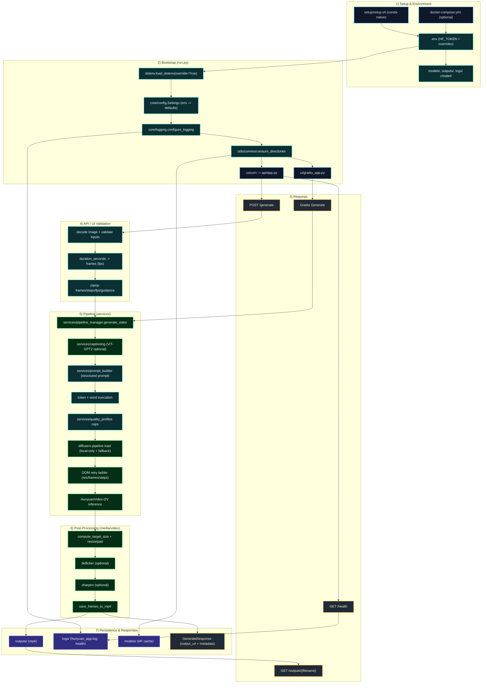

# HunyuanVideo Production Starter Project

End-to-end image-to-video generation service powered by `hunyuanvideo-community/HunyuanVideo-I2V`.

Includes:
- FastAPI REST API
- Gradio UI
- Conda-native runtime (recommended for remote GPU containers)
- Optional Docker runtime (only when host Docker access is available)

## Runtime Modes

### 1) Conda-native (recommended)

Use this when you do not have host-level Docker access (common on rented GPU/container instances).

```bash
cd /path/to/text-to-video-hunyuan-model
chmod +x setup/setup.sh
HF_TOKEN=hf_xxx ./setup/setup.sh
```

If `.env` already has a valid `HF_TOKEN`, this also works:

```bash
cd /path/to/text-to-video-hunyuan-model
./setup/setup.sh
```

What it does:
- Installs missing OS packages
- Installs/configures Conda (`/opt/conda`)
- Creates env `hunyuanvideo`
- Installs Python dependencies
- Configures `.env` paths
- Starts `python run.py`
- Waits for `/health`

Optional full E2E test during setup:

```bash
RUN_GENERATE_TEST=1 ./setup/setup.sh
```

### 2) Docker (optional, host access required)

Only use this if you control the host daemon and NVIDIA container runtime.

```bash
cp .env_template .env
# set HF_TOKEN in .env
docker compose up --build
```

## Project Flow (Mermaid)



## File & Folder Structure

```text
.
|-- app/                      # Application package
|   |-- api/                  # FastAPI app + schemas
|   |-- core/                 # config + logging setup
|   |-- media/                # video post-processing + mp4 encode
|   |-- services/             # pipeline manager, quality profiles, prompt builder, captioning
|   |-- ui/                   # Gradio UI
|   `-- utils/                # shared helpers (dirs, sanitize, clamp)
|-- setup/                    # setup script + docs
|-- scripts/                  # benchmark tooling
|-- tests/                    # tests and sample fixtures
|-- models/                   # HF cache (runtime)
|-- outputs/                  # generated mp4 files
|-- logs/                     # runtime logs + health snapshot
|-- run.py                    # entrypoint (starts API + Gradio)
|-- Dockerfile                # container build
|-- docker-compose.yml        # docker runtime
|-- environment.yml           # conda environment spec
|-- requirements.txt          # pip dependencies
|-- .env_template             # env template
`-- .env                      # local overrides (auto-loaded, overrides env)
```

## Requirements

### Conda-native
- Linux x86_64
- NVIDIA GPU + working driver (`nvidia-smi`)
- Internet access for model/dependency download
- Hugging Face token with access to the model

### Docker mode
- Ubuntu host with Docker Engine + Compose v2
- NVIDIA Container Toolkit configured for Docker

## URLs
- API: `http://localhost:8000`
- Swagger UI: `http://localhost:8000/docs`
- Gradio UI: `http://localhost:7860`

## API Example

```bash
curl -X POST "http://localhost:8000/generate" \
  -F "image=@/absolute/path/input.png" \
  -F "prompt=cinematic camera dolly with gentle subject motion" \
  -F "subject=person" \
  -F "action=turning head" \
  -F "camera_motion=dolly in" \
  -F "shot_type=close-up" \
  -F "lighting=soft daylight" \
  -F "mood=cinematic" \
  -F "negative_prompt=flicker, jitter, deformed anatomy" \
  -F "duration_seconds=8" \
  -F "guidance_scale=6.0" \
  -F "steps=30" \
  -F "fps=16" \
  -F "quality_profile=balanced" \
  -F "output_long_edge=1080" \
  -F "enable_deflicker=true" \
  -F "enable_sharpen=false" \
  -F "seed=42"
```

Download generated file from `output_url`:

```bash
curl -O "http://localhost:8000/outputs/<filename>.mp4"
```

## Sample Test (Local)

Use the bundled sample image + prompt (from `tests/samples/02`) to validate a full end-to-end run.

### 20s output (API)

```bash
PROMPT_TEXT="$(cat tests/samples/02/prompt.txt)"
curl -X POST "http://localhost:8000/generate" \
  -F "image=@tests/samples/02/img.jpg" \
  -F "prompt=${PROMPT_TEXT}" \
  -F "duration_seconds=20" \
  -F "fps=16" \
  -F "num_frames=320" \
  -F "steps=16" \
  -F "quality_profile=balanced" \
  -F "output_long_edge=720" \
  -F "enable_deflicker=false" \
  -F "enable_sharpen=false"
```

Download the result using the `output_url` returned by the API:

```bash
curl -O "http://localhost:8000/outputs/<filename>.mp4"
```

## Performance Notes (L40S)

Measured on a single NVIDIA L40S (48GB) with captioning enabled (on-demand GPU load/unload), CPU offload enabled, and `MAX_INPUT_IMAGE_SIDE=384`. Short clips may start at higher input resolutions when `PREFER_HIGH_RES=1`.

| Scenario | Frames / FPS | Steps | Output Long Edge | Captioning | Total Time |
| --- | --- | --- | --- | --- | --- |
| 6s sample (tests/samples/02) | 96 / 16 | 16 | 720 | enabled | ~68s |
| 20s sample (tests/samples/02) | 320 / 16 | 16 | 720 | enabled | ~263s |
| 10s face edit (tests/samples/05) | 80 / 8 | 16 | 1080 | enabled | ~396s |

Notes:
- Times include caption generation + video encode.
- Increasing `MAX_INPUT_IMAGE_SIDE`, resolution, steps, or frames will increase runtime and VRAM usage.

## Structured Prompt Fields (Gradio + API)

| Field | Options |
| --- | --- |
| subject | person, product, food, fashion, animal, vehicle, architecture, landscape, cityscape, gadget |
| action | walking, turning head, smiling, hand gesture, hair movement, pouring, rotating, hovering, panning reveal, still |
| camera_motion | static, slow pan, tilt, dolly in, dolly out, orbit, handheld, zoom in, zoom out |
| shot_type | close-up, medium, wide, macro, overhead, low angle, high angle |
| lighting | soft daylight, golden hour, studio softbox, neon, backlit, overcast, candlelight |
| mood | cinematic, calm, energetic, moody, dreamy, documentary, romantic, dramatic |

Output long-edge presets: `720`, `1080`, `1440` (aspect ratio derived from the input image).

## Important Runtime Notes

- `transformers` is pinned to `<5.0.0` for model compatibility.
- `.env` is auto-loaded on startup via `python-dotenv` with `override=True` (values in `.env` take precedence).
- xFormers attention is opt-in. Set `ENABLE_XFORMERS=1` in `.env` to enable.
- Setup pins all model/cache paths to `./models` (`HF_HOME`, `HF_HUB_CACHE`, `TORCH_HOME`).
- OOM safety defaults:
  - input images are auto-resized based on GPU VRAM when `AUTO_MAX_INPUT_SIDE=1`
  - set `MAX_INPUT_IMAGE_SIDE` to a number to override auto sizing
  - optional quality-first boost for short clips: `PREFER_HIGH_RES=1` (default) with `PREFER_HIGH_RES_MAX_FRAMES` allows a higher initial resolution and falls back on OOM
  - conservative fallback profile uses `OOM_SAFE_NUM_FRAMES=32` and `OOM_SAFE_STEPS=12`
  - retry order starts with user-requested `frames/steps` at the planned resolution (boosted for short clips when enabled), and downgrades only after OOM
- Output video is resized to the selected long-edge preset while preserving input aspect ratio.
- If `duration_seconds` is provided (API or UI), `num_frames` is derived from `duration_seconds × fps` and then capped by the selected quality profile.
- Prompt enhancement defaults:
  - builds a structured prompt from dropdown fields + user text
  - optionally prepends a caption (ViT-GPT2) for better identity anchoring
  - appends an internal realism suffix to the user prompt
  - applies a default negative prompt to reduce flicker/fade/morph artifacts (can be overridden)
  - enforces word limits to avoid CLIP token overflow (override via `MAX_PROMPT_WORDS`, `MAX_NEGATIVE_PROMPT_WORDS`)
- Deflicker post-processing is disabled by default; toggle via `ENABLE_DEFLICKER` or the API parameter.
- Optional sharpening can be enabled via `ENABLE_SHARPEN` to recover crisp motion.
- Model loading is local-only by default. If local files are missing, `ALLOW_REMOTE_FALLBACK=1` lets it download as a fallback.
- CPU offload defaults:
  - `ENABLE_SEQUENTIAL_CPU_OFFLOAD=0`
  - `ENABLE_MODEL_CPU_OFFLOAD=1`
- Captioning defaults:
  - `CAPTION_MODEL_ID=nlpconnect/vit-gpt2-image-captioning`
  - `CAPTION_DEVICE=cuda`
  - `CAPTION_UNLOAD_AFTER_USE=1` (load on-demand, unload after each request)
- Gradio UI uses duration + FPS to auto-compute frames (`frames = duration × fps`); frame count is capped by quality profile at runtime.
- Progress logs in `logs/hunyuan_app.log`:
  - `PROGRESS_LOG_EVERY_STEPS=1`
  - `PROGRESS_BAR_WIDTH=24`
- First startup may take a long time due to model download.
- Quality profiles cap max frames/steps/input side for stability (`low`, `balanced`, `high`). Set `QUALITY_PROFILE` and override caps via `MAX_FRAMES_BY_PROFILE`, `MAX_STEPS_BY_PROFILE`, `MAX_INPUT_SIDE_BY_PROFILE`.

## Persistence
- `./models` stores model/cache files
- `./outputs` stores generated MP4 files
- `./logs` stores runtime logs (`hunyuan_app.log`, health snapshot, pid file)

Both persist across restarts in the same filesystem.
`hunyuan_app.log` is append-only by default in `setup/setup.sh`, so previous runs remain in the same file.

## Setup Folder

See:
- `setup/setup.sh` for full automated setup
- `setup/setup.md` for usage, overrides, and troubleshooting
- `setup/vscode-extensions.txt` for auto-install extension list

## Benchmark Script

Run the bundled prompt benchmark set:

```bash
python scripts/benchmark_prompts.py --json scripts/benchmark_prompts.json
```

Run against sample folders (each subfolder with `img.*` and `prompt.txt`):

```bash
python scripts/benchmark_prompts.py --samples-dir tests/samples
```

Outputs are written to `outputs/benchmarks/<timestamp>/` along with `benchmark_results.json`.
